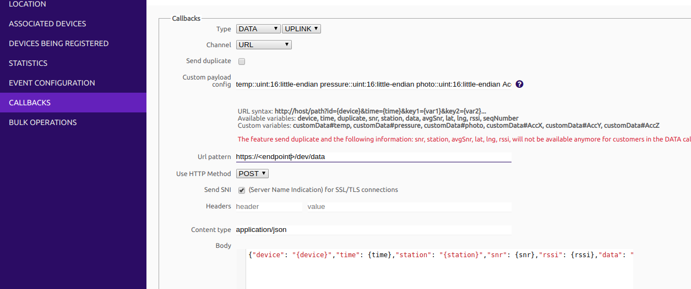

# IoT with SigFox and AWS

This project combines the  [XKit development kit](https://www.thinxtra.com/solutions/thinxtraproducts/xkit/) from [Thinxtra](https://www.thinxtra.com) 
with AWS services including Lambda. IoT Core, and the Glue Data Catalog to sense environmental
parameters including temperature, pressure, light intensity and 3D accelration, and store the
data in the cloud for processing and analysis.

Please note - if you have recently acquired your Xkit, it does come with a free years subscription
to the SigFox network, after which time you will need to purchase a plan to enable your board
to communicate with the network. At the time of writing I purchased a year of connectivity
with each device allowed to transmit up to 50 messages / day, for AUD$21.

The code that runs on the Uno board to which the Thinxtra shield is connected, together with the required libraries, is provided in

```
device/
```

The AWS side of things is handled in

```
backend/sensor-service/
```

To deploy the cloud infrastructure, ensure you have [the serverless framework](https://serverless.com/) installed and then run

```
sensor-service> sls deploy
```

The serverless script will provide details of the API gateway endpoint that was created, which you will need to configure the callback in the SigFox backend.

 


